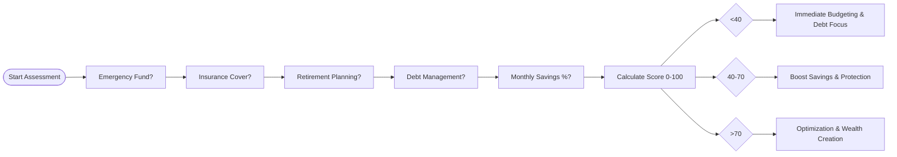
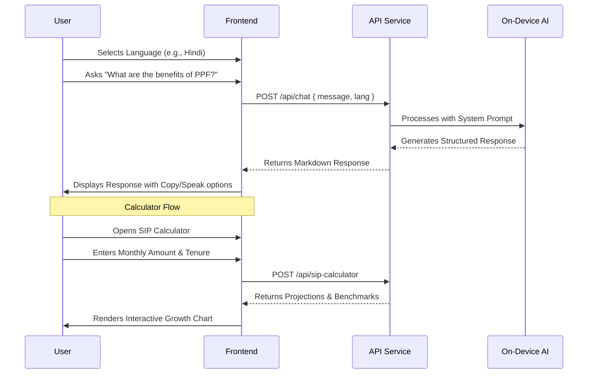
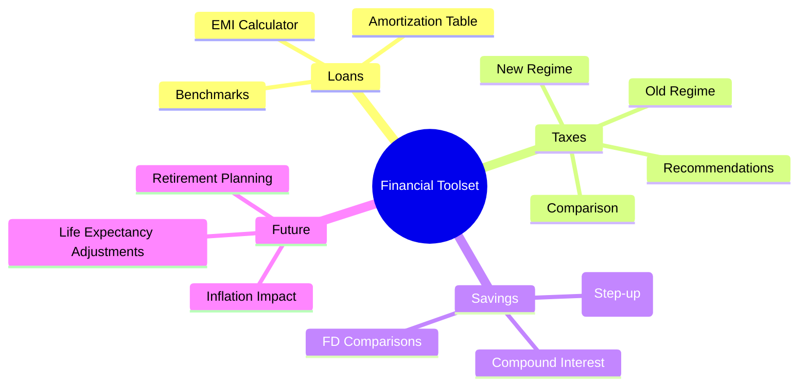
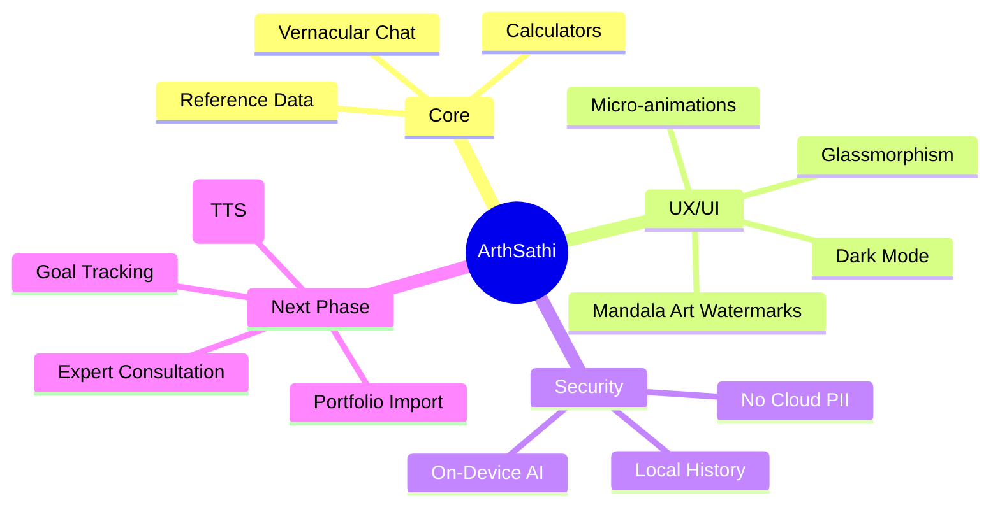

# ArthSathi (अर्थसाथी) 🏦
### *Your Vernacular On-Device Financial Companion*

ArthSathi is a cutting-edge, privacy-first financial advisory platform designed specifically for the Indian ecosystem. It combines the power of on-device AI with comprehensive financial tools to provide personalized advice in multiple Indian languages.

---

## 🚀 Overview

ArthSathi aims to bridge the financial literacy gap in India by providing an accessible, easy-to-use interface for complex financial planning. Whether you're calculating your taxes for FY 2024-25, planning for retirement, or just curious about the latest FD rates, ArthSathi has you covered—all while keeping your data private and secure on your device.

---

## 🛠️ Tech Stack

- **Framework**: [Next.js 16](https://nextjs.org/) (App Router, Client Components)
- **Styling**: [Tailwind CSS 4](https://tailwindcss.com/)
- **UI Components**: [Shadcn UI](https://ui.shadcn.com/) (Radix UI)
- **Animations**: [Framer Motion](https://www.framer.com/motion/)
- **Charts**: [Recharts](https://recharts.org/)
- **State Management**: [Zustand](https://docs.pmnd.rs/zustand/)
- **Database/ORM**: [Prisma](https://www.prisma.io/) with SQLite
- **AI Integration**: [z-ai-web-dev-sdk](https://github.com/google/z-ai-web-dev-sdk) (On-device LLM & ASR)
- **Icons**: [Lucide React](https://lucide.dev/)

### Tech Stack Breakdown
| Category | Technology | Purpose |
| :--- | :--- | :--- |
| **Frontend** | Next.js 16 | App Router & Server Components |
| **Styling** | Tailwind CSS 4 | Utility-first styling & Modern CSS |
| **State** | Zustand | Global chat & language state |
| **AI** | z-ai-web-dev-sdk | On-device LLM (Qwen) & ASR |
| **Database** | Prisma + SQLite | Local data persistence |
| **Visualization** | Recharts | Financial growth & comparison charts |
| **Animation** | Framer Motion | Smooth UI transitions & micro-interactions |
| **Forms** | React Hook Form | Calculator input management |
| **Icons** | Lucide React | Consistent visual language |

---

## ✨ Key Features

### 💬 AI-Powered Vernacular Chat
- **Multilingual Support**: Chat in Hindi, Tamil, Bengali, Telugu, Marathi, Gujarati, Kannada, and English.
- **Voice Input**: Use the microphone icon to ask questions naturally in your language.
- **Financial Expertise**: Fine-tuned for Indian banking, tax laws, and government schemes.
- **Privacy First**: All processing is optimized for on-device execution with clear privacy indicators.

### 🧮 Comprehensive Financial Calculators
- **EMI Calculator**: Calculate Home, Car, or Personal loan EMIs with full year-wise amortization schedules.
- **Tax Calculator**: Compare Old vs. New Tax Regimes (FY 2024-25) with personalized recommendations.
- **SIP Calculator**: Plan your wealth with standard or Step-Up SIP options and benchmark comparisons.
- **Retirement Planner**: Determine the corpus needed for a secure future, accounting for inflation and EPF/NPS.
- **Inflation Calculator**: Visualize how inflation erodes purchasing power across different categories like Education and Healthcare.
- **Compound Interest**: Detailed breakdowns with support for different compounding frequencies and monthly contributions.

### 📊 Reference & Tools
- **Real-time FD Rates**: Visual comparison charts for major Indian banks.
- **Government Schemes**: Detailed info on PPF, SSY, SCSS, NPS, and more.
- **Financial Health Score**: A quick assessment tool to evaluate your financial preparedness.
- **Search & Filter**: Find specific information within your chat history instantly.

---

---

## 🏥 Financial Health Assessment Flow



## 📐 System Architecture

```mermaid
graph TD
    subgraph Client_Side [Client Side - Browser]
        User([User]) <--> UI[Next.js 16 UI / Tailwind 4]
        UI <--> Store[Zustand State Management]
        Store <--> LocalStorage[(Local History)]
        UI <--> Charts[Recharts Data Viz]
    end

    subgraph API_Layer [API Layer - Next.js Routes]
        UI <--> API_Chat[/api/chat]
        UI <--> API_Calc[/api/calculators]
        UI <--> API_Data[/api/financial-data]
        UI <--> API_Voice[/api/transcribe]
    end

    subgraph Logic_Engine [Core Engines]
        API_Chat <--> LLM[On-Device AI SDK]
        API_Calc --> Math[Financial Math Engines]
        API_Data <--> DB[(Prisma / SQLite)]
        API_Voice <--> ASR[Speech-to-Text SDK]
    end
```

---

## 🔄 User Workflow



## 🛠️ Multi-Calculator Suite



---

## 🧭 Project Roadmap



---

## 🛠️ Setup & Installation

### Prerequisites
- [Node.js](https://nodejs.org/) (v18+)
- [npm](https://www.npmjs.com/) or [Bun](https://bun.sh/)

### Steps
1. **Clone the repository**:
   ```bash
   git clone <repository-url>
   cd arthsathi
   ```

2. **Install dependencies**:
   ```bash
   npm install
   # OR
   bun install
   ```

3. **Environment Configuration**:
   Create a `.env` file in the root directory:
   ```env
   DATABASE_URL="file:./dev.db"
   ```

4. **Initialize Database**:
   ```bash
   npx prisma db push
   npx prisma generate
   ```

5. **Run the Development Server**:
   ```bash
   npm run dev
   # OR
   bun dev
   ```

6. **Open in Browser**:
   Navigate to `http://localhost:3000`.

---

## 📜 Disclaimer
*ArthSathi is an AI-powered advisory tool and is not affiliated with RBI, SEBI, or IRDAI. The information provided is for educational purposes only. Please consult a certified financial planner before making major investment decisions.*

---

## 🎨 Design Aesthetics
ArthSathi features a premium "Emerald Finance" theme:
- **Glassmorphism**: Translucent calculator dialogs and sidebars.
- **Indian Motifs**: Decorative Mandala and Rangoli watermarks.
- **Dynamic Animations**: Smooth Framer Motion transitions and floating particles.
- **Accessibility**: 48px touch targets and high-contrast dark mode.

---
Made with ❤️ for India 🇮🇳
