<div align="center">

# अर्थसाथी ArthSathi
 
### 🇮🇳 On-Device Vernacular Financial Advisory AI

**Your Privacy-First Financial Companion — Built for 140 Crore Indians**

[](https://nextjs.org/)
[](https://www.typescriptlang.org/)
[](https://tailwindcss.com/)
[](https://huggingface.co/Qwen/Qwen3-4B)
[](LICENSE)

<p>
  
  
  
  
</p>

</div>

---

## 📑 Table of Contents

- [🎯 Overview](#-overview)
- [🏗️ System Architecture](#-system-architecture)
- [🔄 Data Flow Diagrams](#-data-flow-diagrams)
- [🧩 Component Architecture](#-component-architecture)
- [✨ Feature Showcase](#-feature-showcase)
- [🧮 Financial Calculators](#-financial-calculators)
- [🗣️ Voice & Multilingual Support](#-voice--multilingual-support)
- [🤖 AI Model & Fine-Tuning Pipeline](#-ai-model--fine-tuning-pipeline)
- [📊 Tax Regime Comparison (Budget 2025)](#-tax-regime-comparison-budget-2025)
- [📁 Project Structure](#-project-structure)
- [🔌 API Reference](#-api-reference)
- [🚀 Getting Started](#-getting-started)
- [🧪 Technology Stack](#-technology-stack)
- [🎨 Design System](#-design-system)
- [📈 Performance & Metrics](#-performance--metrics)
- [🔒 Privacy & Security](#-privacy--security)
- [🗺️ Roadmap](#-roadmap)
- [🤝 Contributing](#-contributing)
- [📄 License](#-license)

---

## 🎯 Overview

**ArthSathi (अर्थसाथी)** — meaning *"Financial Companion"* — is an on-device, vernacular financial advisory AI built specifically for Indian citizens. It answers questions about Fixed Deposits, Savings, Tax Planning, PPF, Loans, Government Schemes, and more — all in **8+ Indian languages** — without sending any Personal Identifiable Information (PII) to the cloud.

### Why ArthSathi?

```
┌──────────────────────────────────────────────────────────────┐
│                    THE PROBLEM                                │
│                                                              │
│  🏦 78% of Indians don't have access to financial advisors  │
│  🌐 Most finance apps are English-only                      │
│  ☁️ Financial data is sent to cloud — privacy concerns      │
│  📊 Generic advice doesn't fit Indian tax/savings landscape │
│                                                              │
│                    THE SOLUTION                               │
│                                                              │
│  ✅ Vernacular: Speaks your language (8+ Indian languages)  │
│  ✅ On-Device: No PII leaves your device                    │
│  ✅ Indian-First: Built for Indian financial ecosystem      │
│  ✅ AI-Powered: Fine-tuned Qwen3-4B with Indian finance    │
│  ✅ Voice-Enabled: Speak & listen in your language          │
└──────────────────────────────────────────────────────────────┘
```

### Key Numbers

| Metric | Value |
|--------|-------|
| 🌐 Languages Supported | 8+ (Hindi, Tamil, Bengali, Telugu, Marathi, Gujarati, Kannada, English + 4 more) |
| 🧮 Financial Calculators | 7 (EMI, SIP, Tax, Compound Interest, Retirement, Inflation, Health Score) |
| 📊 Sample Queries | 10+ pre-built financial queries |
| 🔒 Data Sent to Cloud | Zero PII — only anonymized LLM prompts |
| 🎤 Voice Input/Output | Full ASR + TTS support |
| ⚡ API Endpoints | 13 RESTful routes |
| 📝 Codebase Size | 12,000+ lines of TypeScript |

---

## 🏗️ System Architecture

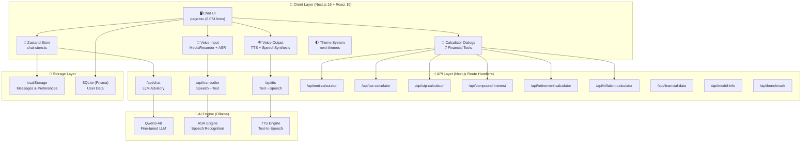

### High-Level Architecture

```
┌─────────────────────────────────────────────────────────────────────┐
│                         BROWSER (Client)                           │
│  ┌───────────────────────────────────────────────────────────────┐  │
│  │                    React 19 + Next.js 16                      │  │
│  │  ┌─────────┐  ┌──────────┐  ┌──────────┐  ┌──────────────┐  │  │
│  │  │  Chat   │  │ Calculator│  │  Voice   │  │   Sidebar    │  │  │
│  │  │   UI    │  │  Dialogs  │  │ I/O Panel│  │  Reference   │  │  │
│  │  └────┬────┘  └─────┬────┘  └────┬─────┘  └──────┬───────┘  │  │
│  │       │             │            │                │           │  │
│  │  ┌────▼─────────────▼────────────▼────────────────▼────────┐  │  │
│  │  │              Zustand State Management                    │  │  │
│  │  │  messages · language · conversations · bookmarks        │  │  │
│  │  └─────────────────────┬───────────────────────────────────┘  │  │
│  └────────────────────────┼──────────────────────────────────────┘  │
│                           │ fetch() / REST API                     │
└───────────────────────────┼────────────────────────────────────────┘
                            │
┌───────────────────────────▼────────────────────────────────────────┐
│                    NEXT.JS API ROUTES                              │
│  ┌──────────┐ ┌───────────┐ ┌──────────┐ ┌────────────────────┐  │
│  │ /api/chat│ │/api/tts   │ │/api/trans│ │ Calculator APIs    │  │
│  │ LLM Call │ │ Text→WAV  │ │cribe     │ │ EMI·Tax·SIP·CI    │  │
│  └─────┬────┘ └─────┬─────┘ └────┬─────┘ │ Ret·Inflate·Fin   │  │
│        │            │            │        └────────────────────┘  │
└────────┼────────────┼────────────┼────────────────────────────────┘
         │            │            │
┌────────▼────────────▼────────────▼────────────────────────────────┐
│                 ollama ai (AI Engine)                       │
│  ┌──────────────┐  ┌──────────────┐  ┌──────────────────────┐    │
│  │  LLM (Qwen)  │  │  TTS Engine  │  │  ASR Engine          │    │
│  │  POST /chat  │  │  POST /tts   │  │  POST /transcribe    │    │
│  └──────────────┘  └──────────────┘  └──────────────────────┘    │
└───────────────────────────────────────────────────────────────────┘
```

---

## 🔄 Data Flow Diagrams

### Chat Query Flow

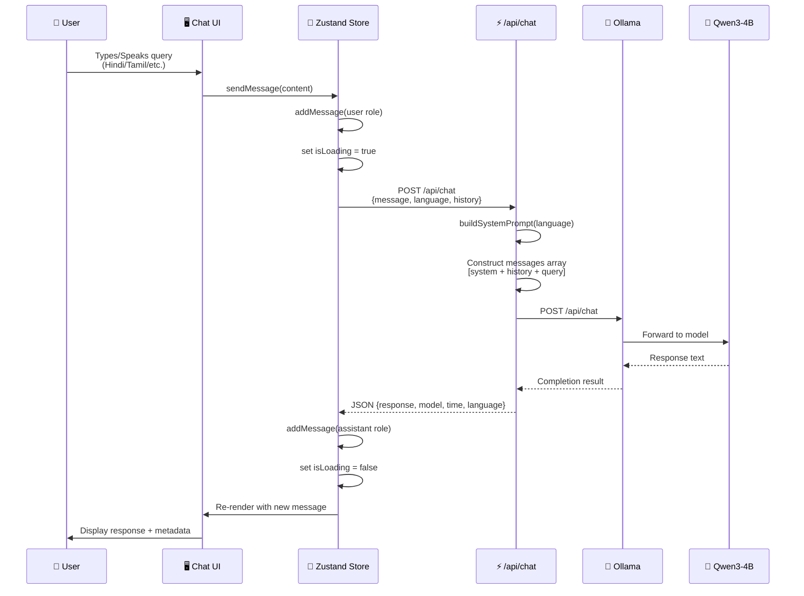

### Voice Conversation Flow

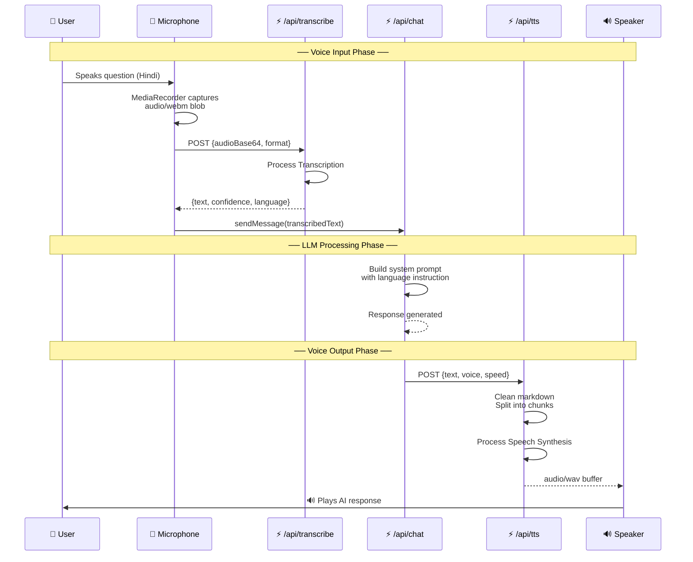

### Calculator Flow

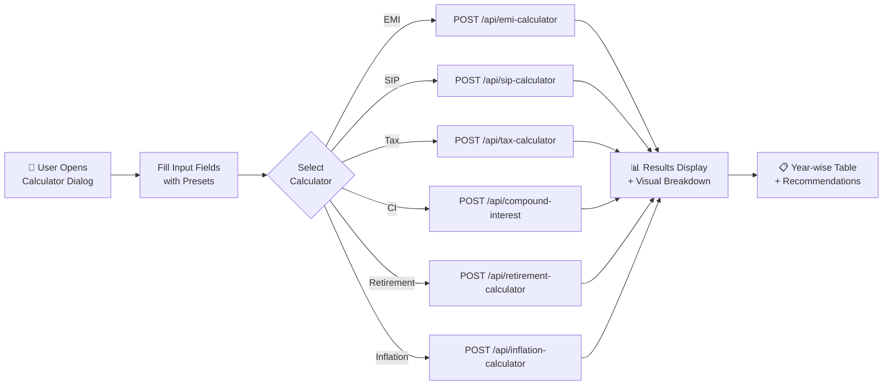

---

## 🧩 Component Architecture

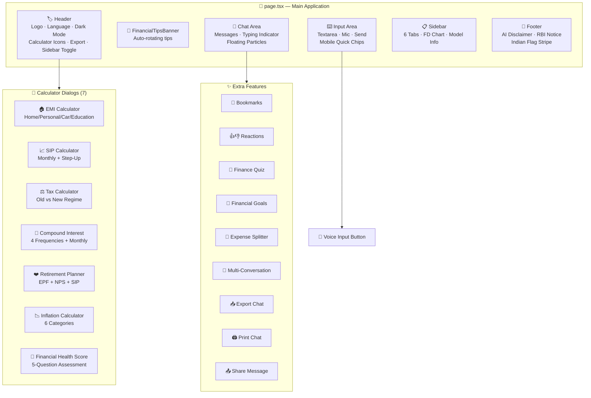

### UI Component Tree

```
App (page.tsx)
├── ThemeProvider (next-themes)
├── TooltipProvider
├── Header
│   ├── Logo (अ)
│   ├── Title (अर्थसाथी)
│   ├── Privacy Badges (On-Device · No Cloud PII · Fine-tuned)
│   ├── Language Selector (Select)
│   ├── Dark Mode Toggle (Sun/Moon)
│   ├── Calculator Buttons (7 icons)
│   ├── Export Button (Download)
│   ├── Clear Chat (Trash2)
│   └── Sidebar Toggle (PanelRight)
├── FinancialTipsBanner
├── Chat Area
│   ├── WelcomeScreen (when no messages)
│   │   ├── Animated Logo
│   │   ├── Gradient Title
│   │   ├── Badges (Privacy · On-Device · Vernacular)
│   │   ├── Model Badges (Qwen3 · FinanceParam · BhashaBench)
│   │   ├── Animated Counters (8 Languages · 7 Calcs · 10+ Queries)
│   │   ├── Feature Cards (4 cards with hover effects)
│   │   └── Query Buttons (10 queries with categories)
│   ├── Message List
│   │   ├── ChatMessage (user) — gradient bg, slide from right
│   │   ├── ChatMessage (assistant) — markdown, actions
│   │   │   ├── ReactMarkdown + remarkGfm
│   │   │   ├── AI Badge + Model Badge + Confidence Dot
│   │   │   ├── Timestamp + Processing Time + Language
│   │   │   └── Actions: Bookmark · ThumbsUp/Down · Copy · Speak
│   │   └── TypingIndicator — 3-stage progress
│   └── Floating Particles (8 CSS animated dots)
├── Input Area
│   ├── Textarea (auto-resize)
│   ├── Mic Button (voice input with recording indicator)
│   ├── Send Button (animated pulse)
│   └── Privacy Lock Icon
├── Sidebar
│   ├── Tabs (Conversations · Queries · FD Rates · Schemes · Tax · Model)
│   ├── Conversations List
│   ├── FD Rate Bar Chart (recharts)
│   └── Model Info Card
├── Calculator Dialogs (7 × Dialog/Sheet)
│   ├── Input Fields with Presets
│   ├── Results with Visual Bars
│   ├── Year-wise Collapsible Tables
│   └── Recommendations
└── Footer
    ├── Indian Flag Stripe (saffron · white · green)
    ├── AI Disclaimer
    ├── RBI/SEBI/IRDAI Notice
    └── Data Source Reference
```

---

## ✨ Feature Showcase

### 💬 Vernacular Chat

```
┌─────────────────────────────────────────────────────┐
│  👤 User (Hindi):                                    │
│  ┌─────────────────────────────────────────────────┐ │
│  │ FD की ब्याज दरें क्या हैं?                        │ │
│  └─────────────────────────────────────────────────┘ │
│                                                       │
│  🤖 ArthSathi:                                        │
│  ┌─────────────────────────────────────────────────┐ │
│  │ 📊 बैंक / ब्याज दर / सीनियर सिटीजन              │ │
│  │ ─────────────────────────────────               │ │
│  │ SBI      │ 6.80%   │ 7.30%                      │ │
│  │ HDFC     │ 7.10%   │ 7.60%                      │ │
│  │ ICICI    │ 7.00%   │ 7.50%                      │ │
│  │ PNB      │ 6.80%   │ 7.30%                      │ │
│  │ BOB      │ 7.15%   │ 7.65%                      │ │
│  │                                                  │ │
│  │ ✅ टिप: सीनियर सिटीजन को 0.50% अतिरिक्त मिलता │ │
│  │ ⚠️ Disclaimer: AI-generated financial guidance   │ │
│  └─────────────────────────────────────────────────┘ │
│  🔖 👍 👎 📋 🔊  ·  23,456ms · हिन्दी · 🔒 On-device │
└─────────────────────────────────────────────────────┘
```

### 🎤 Voice Conversation

```
┌──────────────────────────────────────────────┐
│                                               │
│    🎤 [Hold to Speak] ────→ 🤖 Processing    │
│         Hindi Voice          ↓                │
│                          📝 Transcribed:      │
│                          "PPF में निवेश       │
│                           करने के क्या        │
│                           फायदे हैं?"         │
│                               ↓                │
│                          🧠 LLM Response      │
│                               ↓                │
│                          🔊 AI Voice Reply    │
│                          (in Hindi)           │
│                                               │
└──────────────────────────────────────────────┘
```

### 🌐 8+ Indian Languages

| # | Language | Native Script | Code | Speech Code |
|---|----------|---------------|------|-------------|
| 1 | Hindi | हिन्दी | hi | hi-IN |
| 2 | Tamil | தமிழ் | ta | ta-IN |
| 3 | Bengali | বাংলা | bn | bn-IN |
| 4 | Telugu | తెలుగు | te | te-IN |
| 5 | Marathi | मराठी | mr | mr-IN |
| 6 | Gujarati | ગુજરાતી | gu | gu-IN |
| 7 | Kannada | ಕನ್ನಡ | kn | kn-IN |
| 8 | English | English | en | en-IN |
| 9 | Punjabi | ਪੰਜਾਬੀ | pa | pa-IN |
| 10 | Odia | ଓଡ଼ିଆ | or | or-IN |
| 11 | Urdu | اردو | ur | ur-IN |
| 12 | Malayalam | മലയാളം | ml | ml-IN |

---

## 🧮 Financial Calculators

### Calculator Overview

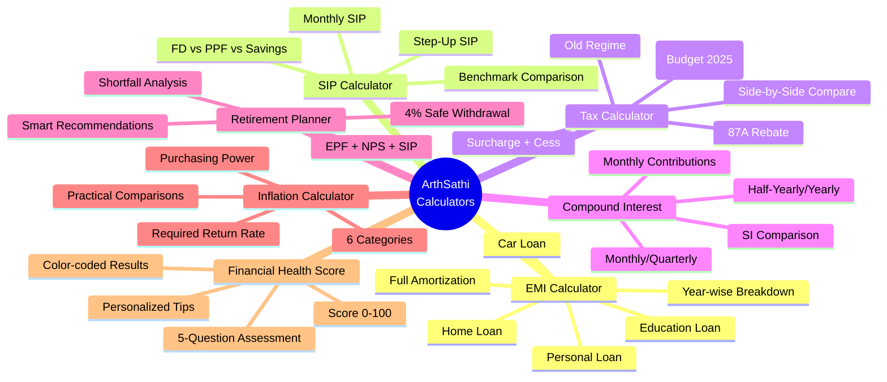

### EMI Calculator Formula

```
                    P × r × (1+r)ⁿ
    EMI = ─────────────────────────
              (1+r)ⁿ − 1

    Where:
    P = Principal Loan Amount
    r = Monthly Interest Rate (Annual Rate / 12 / 100)
    n = Total Number of Months
```

### SIP Calculator Formula

```
    FV = Monthly × [((1+r)ⁿ − 1) / r] × (1+r)

    Step-Up SIP:
    For each year y:
      SIP_y = SIP_{y-1} × (1 + stepUp%)
      Accumulate with monthly compounding

    Benchmarks:
    ┌──────────┬───────┬─────────────────┐
    │ Instrument│ Rate │ 10yr Value (₹10K/mo) │
    ├──────────┼───────┼─────────────────┤
    │ SIP      │ 12%   │ ₹23,23,391      │
    │ PPF      │ 7.1%  │ ₹17,36,328      │
    │ FD       │ 7.0%  │ ₹17,21,714      │
    │ Savings  │ 3.5%  │ ₹14,50,192      │
    └──────────┴───────┴─────────────────┘
```

### Compound Interest Formula

```
    A = P × (1 + r/n)^(n×t)

    Where:
    A = Maturity Amount
    P = Principal
    r = Annual Interest Rate
    n = Compounding Frequency (1/2/4/12)
    t = Tenure in Years

    With Monthly Contributions:
    FV_contributions = MC × [((1+r/n)^(n×t) - 1) / (r/n)]

    Effective Annual Rate = (1 + r/n)ⁿ − 1
```

---

## 🗣️ Voice & Multilingual Support

### Voice Architecture

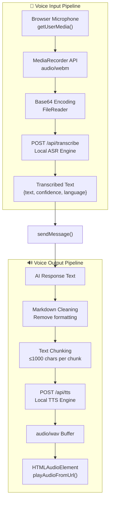

### Language Processing Flow

```
User selects "हिन्दी" (Hindi)
         │
         ▼
┌─────────────────────────┐
│ Store: language = "hi"  │
│ LANG_CODE_TO_NAME:      │
│   "hi" → "hindi"        │
└──────────┬──────────────┘
           │
           ▼
┌─────────────────────────────────────────┐
│ /api/chat:                              │
│   LANGUAGE_CONFIG["hindi"] = {          │
│     nativeName: "हिंदी",                │
│     instruction: "Respond entirely in   │
│       Hindi (Devanagari script)..."     │
│   }                                      │
│                                          │
│   System Prompt includes:               │
│   • Language instruction                │
│   • Indian financial knowledge          │
│   • Response guidelines                 │
│   • Mandatory disclaimer                │
└──────────┬──────────────────────────────┘
           │
           ▼
┌─────────────────────────────────────────┐
│ TTS: LANG_TO_SPEECH["hi"] = "hi-IN"    │
│   → utterance.lang = "hi-IN"           │
│   → Local TTS Engine generates         │
│     Hindi speech audio                  │
└─────────────────────────────────────────┘
```

---

## 🤖 AI Model & Fine-Tuning Pipeline

### Model Architecture

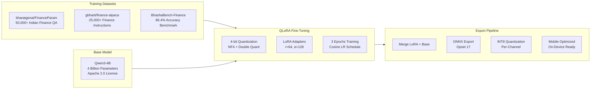

### Training Pipeline

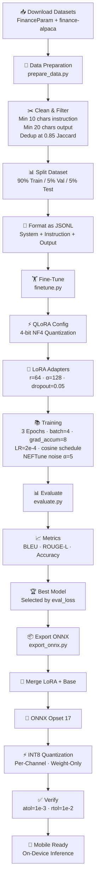

### Training Configuration

| Parameter | Value |
|-----------|-------|
| **Model** | Qwen/Qwen3-4B |
| **Method** | QLoRA (4-bit Quantization + LoRA) |
| **Quantization** | NF4 with Double Quantization |
| **LoRA Rank** | 64 |
| **LoRA Alpha** | 128 |
| **LoRA Dropout** | 0.05 |
| **Target Modules** | q_proj, k_proj, v_proj, o_proj, gate_proj, up_proj, down_proj |
| **Epochs** | 3 |
| **Batch Size** | 4 (effective 32 with grad_accum) |
| **Learning Rate** | 2e-4 (cosine schedule) |
| **Warmup Ratio** | 0.1 |
| **Precision** | bfloat16 |
| **Optimizer** | paged_adamw_8bit |
| **Max Seq Length** | 2048 |
| **NEFTune Noise** | α = 5 |

### Evaluation Metrics

```
┌────────────────────────────────────────────────────────┐
│                  Evaluation Pipeline                    │
│                                                        │
│  ┌──────────┐    ┌──────────────┐    ┌──────────────┐ │
│  │ Test Set │───▶│ Generate     │───▶│ Compute      │ │
│  │ 5% split │    │ Predictions  │    │ Metrics      │ │
│  └──────────┘    │ temp=0.1     │    │              │ │
│                  │ top_p=0.9    │    │ • BLEU       │ │
│                  │ max=512 tok  │    │ • ROUGE-L    │ │
│                  └──────────────┘    │ • Accuracy   │ │
│                                      └──────────────┘ │
│                                                        │
│  Languages: English (en) + Hindi (hi)                  │
│  Best Model: Selected by lowest eval_loss              │
└────────────────────────────────────────────────────────┘
```

---

## 📊 Tax Regime Comparison (Budget 2025)

### New Tax Regime — FY 2025-26 (Default)

```
┌────────────────────────────────────────────────────┐
│           NEW REGIME (Budget 2025)                  │
│            Default from FY 2025-26                  │
│                                                    │
│  Income Slab         │ Tax Rate                    │
│  ────────────────────┼─────────────                │
│  Up to ₹4,00,000     │     Nil                     │
│  ₹4,00,001 - ₹8L     │      5%                     │
│  ₹8,00,001 - ₹12L    │     10%                     │
│  ₹12,00,001 - ₹16L   │     15%                     │
│  ₹16,00,001 - ₹20L   │     20%                     │
│  ₹20,00,001 - ₹24L   │     25%                     │
│  Above ₹24,00,000     │     30%                     │
│                                                    │
│  Standard Deduction: ₹75,000                       │
│  87A Rebate: ≤₹12L taxable → max ₹60,000          │
│  No deductions (80C/80D/HRA/24b)                   │
│  Surcharge capped at 25%                           │
│  Cess: 4% Health & Education                       │
└────────────────────────────────────────────────────┘
```

### Old Tax Regime — FY 2025-26

```
┌────────────────────────────────────────────────────┐
│              OLD REGIME                             │
│                                                    │
│  Income Slab         │ Tax Rate                    │
│  ────────────────────┼─────────────                │
│  Up to ₹2,50,000     │     Nil                     │
│  ₹2,50,001 - ₹5L     │      5%                     │
│  ₹5,00,001 - ₹10L    │     20%                     │
│  Above ₹10,00,000     │     30%                     │
│                                                    │
│  Standard Deduction: ₹50,000                       │
│  87A Rebate: ≤₹5L taxable → max ₹12,500           │
│  Deductions: 80C(₹1.5L) · 80D · 24b(₹2L)         │
│             HRA · 80CCD(1B)(₹50K)                  │
│  Surcharge: up to 37%                              │
│  Cess: 4% Health & Education                       │
└────────────────────────────────────────────────────┘
```

### Visual Comparison

```mermaid
graph LR
    subgraph Old["📜 Old Regime"]
        O1["0-2.5L: 0%"]
        O2["2.5-5L: 5%"]
        O3["5-10L: 20%"]
        O4["Above 10L: 30%"]
        O5["Std Deduction: ₹50K"]
        O6["80C/80D/HRA/24b ✅"]
    end

    subgraph New["🆕 New Regime (Default)"]
        N1["0-4L: 0%"]
        N2["4-8L: 5%"]
        N3["8-12L: 10%"]
        N4["12-16L: 15%"]
        N5["16-20L: 20%"]
        N6["20-24L: 25%"]
        N7["Above 24L: 30%"]
        N8["Std Deduction: ₹75K"]
        N9["80C/80D/HRA/24b ❌"]
    end

    Old -->|Budget 2025| New
```

### Who Should Use Which Regime?

| Profile | Recommended | Why |
|---------|-------------|-----|
| Salaried, no investments | New | Lower rates, no deductions needed |
| Salaried with 80C/HRA | Old | Deductions > rate benefit |
| Income ₹5-7L | New | 87A rebate up to ₹60K |
| Income ₹15L+ with home loan | Old | 24b ₹2L + 80C + HRA |
| Freelancer / Business | Depends | Compare both with calculator |

---

## 📁 Project Structure

```
arthasathi/
├── 📁 src/
│   ├── 📁 app/
│   │   ├── page.tsx                    # 🏠 Main UI (6,074 lines)
│   │   ├── layout.tsx                  # 📐 Root layout with ThemeProvider
│   │   ├── globals.css                 # 🎨 Custom styles (893 lines)
│   │   └── 📁 api/
│   │       ├── route.ts                # 🔍 Base API
│   │       ├── 📁 chat/
│   │       │   └── route.ts            # 💬 LLM Chat (324 lines)
│   │       ├── 📁 transcribe/
│   │       │   └── route.ts            # 🎤 ASR (246 lines)
│   │       ├── 📁 tts/
│   │       │   └── route.ts            # 🔊 TTS (198 lines)
│   │       ├── 📁 emi-calculator/
│   │       │   └── route.ts            # 🏠 EMI Calc (243 lines)
│   │       ├── 📁 tax-calculator/
│   │       │   └── route.ts            # ⚖️ Tax Calc (357 lines)
│   │       ├── 📁 sip-calculator/
│   │       │   └── route.ts            # 📈 SIP Calc (158 lines)
│   │       ├── 📁 compound-interest/
│   │       │   └── route.ts            # 🏦 CI Calc (271 lines)
│   │       ├── 📁 retirement-calculator/
│   │       │   └── route.ts            # ❤️ Retirement (515 lines)
│   │       ├── 📁 inflation-calculator/
│   │       │   └── route.ts            # 📉 Inflation (405 lines)
│   │       ├── 📁 financial-data/
│   │       │   └── route.ts            # 📊 Reference Data (664 lines)
│   │       ├── 📁 model-info/
│   │       │   └── route.ts            # 🤖 Model Info (84 lines)
│   │       └── 📁 benchmark/
│   │           └── route.ts            # 🏆 Benchmark (53 lines)
│   ├── 📁 store/
│   │   └── chat-store.ts              # 💾 Zustand Store (537 lines)
│   ├── 📁 components/
│   │   └── 📁 ui/                     # 🎨 shadcn/ui components
│   └── 📁 lib/
│       └── db.ts                       # 🗄️ Prisma Client
├── 📁 prisma/
│   └── schema.prisma                   # 📋 Database Schema
├── 📁 fine-tuning/
│   ├── config.yaml                     # ⚙️ Training Config
│   ├── prepare_data.py                 # 📥 Data Preparation
│   ├── finetune.py                     # 🏋️ Fine-Tuning Script
│   ├── evaluate.py                     # 📊 Evaluation Script
│   ├── export_onnx.py                  # 📦 ONNX Export
│   ├── requirements.txt                # 🐍 Python Dependencies
│   └── README.md                       # 📖 Pipeline Docs
├── 📁 db/                              # 💾 SQLite Database
├── package.json                        # 📦 Dependencies
├── tsconfig.json                       # 🔧 TypeScript Config
├── next.config.ts                      # ⚡ Next.js Config
├── tailwind.config.ts                  # 🎨 Tailwind Config
├── .env                                # 🔐 Environment Variables
└── README.md                           # 📖 This File
```

### Code Statistics

| File/Folder | Lines | Purpose |
|-------------|-------|---------|
| `src/app/page.tsx` | 6,074 | Main UI component with all dialogs |
| `src/app/globals.css` | 893 | Custom animations and styles |
| `src/store/chat-store.ts` | 537 | State management (Zustand) |
| `src/app/api/` | 4,948 | 13 API route handlers |
| **Total TypeScript** | **~12,500** | Full application code |
| `fine-tuning/` | ~800 | Python ML pipeline |

---

## 🔌 API Reference

### Chat API

```
POST /api/chat

Request:
{
  "message": "FD की ब्याज दरें क्या हैं?",
  "language": "hindi",          // Required: language name
  "history": [                  // Optional: last 6 messages
    { "role": "user", "content": "..." },
    { "role": "assistant", "content": "..." }
  ]
}

Response (200):
{
  "response": "वर्तमान FD ब्याज दरें...",
  "model": "Qwen3-4B (Fine-tuned)",
  "processingTime": 23456,
  "language": "हिंदी"
}

Error (400/500):
{
  "error": "Description of the error",
  "details": "Technical details",
  "processingTime": 1234
}
```

### Transcribe API (ASR)

```
POST /api/transcribe

Content-Type: application/json
Request:
{
  "audioBase64": "base64-encoded-audio-data",
  "format": "webm"              // Optional: wav, webm, mp3, ogg
}

OR

Content-Type: multipart/form-data
Request:
  audio: <file>                  // WAV/WebM/MP3/OGG file

Response (200):
{
  "text": "FD की ब्याज दरें क्या हैं",
  "confidence": 0.92,
  "language": "hi-IN",
  "duration": 3.5
}
```

### TTS API

```
POST /api/tts

Request:
{
  "text": "वर्तमान FD ब्याज दरें हैं...",
  "voice": "tongtong",           // Optional: voice name
  "speed": 1.0                   // Optional: 0.5-2.0
}

Response (200):
Content-Type: audio/wav
Body: WAV audio buffer
Headers:
  X-Processing-Time: 1234
```

### Calculator APIs

#### EMI Calculator

```
POST /api/emi-calculator

Request:
{
  "principal": 5000000,         // Loan amount in ₹
  "rate": 9,                    // Annual interest rate %
  "tenure": 240,                // Tenure in months
  "type": "home"                // home, personal, car, education
}

Response:
{
  "emi": 44986.30,
  "totalInterest": 5796712,
  "totalPayment": 10796712,
  "principal": 5000000,
  "breakdown": [...],           // Monthly breakdown
  "schedule": [...],            // Year-wise amortization
  "benchmarks": {...}           // Loan type benchmarks
}
```

#### Tax Calculator

```
POST /api/tax-calculator

Request:
{
  "income": 1200000,            // Annual income in ₹
  "regime": "both",             // old, new, or both
  "deductions": {               // For old regime
    "section80C": 150000,
    "section80D": 25000,
    "section80CCD1B": 50000,
    "section24b": 200000,
    "hra": 100000,
    "otherDeductions": 0
  }
}

Response:
{
  "oldRegime": { taxableIncome, taxSlabs, totalTax, effectiveRate, ... },
  "newRegime": { taxableIncome, taxSlabs, totalTax, effectiveRate, ... },
  "comparison": {
    "savingsFromNewRegime": -49400,
    "recommendation": "new",
    "recommendationReason": "New regime saves you ₹49,400..."
  }
}
```

#### SIP Calculator

```
POST /api/sip-calculator

Request:
{
  "monthlyInvestment": 10000,   // Monthly SIP amount
  "expectedReturnRate": 12,     // Expected annual return %
  "tenureYears": 10,            // Investment tenure
  "stepUpPercent": 10           // Optional: annual step-up %
}

Response:
{
  "totalValue": 2323390.76,
  "totalInvested": 1200000,
  "wealthGenerated": 1123390.76,
  "yearlyBreakdown": [...],
  "benchmarkComparison": [
    { "name": "FD (7%)", "totalValue": 1721714, ... },
    { "name": "PPF (7.1%)", "totalValue": 1736328, ... },
    { "name": "Savings (3.5%)", "totalValue": 1450192, ... }
  ]
}
```

#### Compound Interest Calculator

```
POST /api/compound-interest

Request:
{
  "principal": 100000,          // Principal amount
  "rate": 8,                    // Annual interest rate %
  "tenure": 10,                 // Tenure in years
  "compoundingFrequency": 12,   // 1=yearly, 2=half-yearly, 4=quarterly, 12=monthly
  "monthlyContribution": 5000   // Optional monthly addition
}

Response:
{
  "maturityAmount": 1154621.75,
  "totalContributions": 700000,
  "totalInterest": 454621.75,
  "effectiveRate": 8.3,
  "yearWiseBreakdown": [...],
  "comparisonWithSimpleInterest": { ... }
}
```

#### Retirement Calculator

```
POST /api/retirement-calculator

Request:
{
  "currentAge": 30,
  "retirementAge": 60,
  "lifeExpectancy": 85,
  "monthlyExpenses": 30000,
  "currentSavings": 500000,
  "monthlyContribution": 10000,
  "expectedReturnRate": 10,
  "inflationRate": 6,
  "epfMonthly": 5000,
  "npsMonthly": 2000
}

Response:
{
  "corpusNeeded": 51700000,
  "totalAccumulated": 42400000,
  "shortfall": 9300000,
  "additionalMonthlyNeeded": 4081,
  "yearlyProjection": [...],
  "recommendations": [...]
}
```

#### Inflation Calculator

```
POST /api/inflation-calculator

Request:
{
  "currentAmount": 100000,      // Current cost
  "inflationRate": 6,           // Inflation rate %
  "years": 20,                  // Time period
  "category": "general"         // general, education, healthcare, real_estate, food
}

Response:
{
  "futureCost": 320714,
  "purchasingPowerLoss": 68.82,
  "purchasingPowerRetained": 31.18,
  "yearlyBreakdown": [...],
  "practicalComparisons": [...],
  "categorySpecificTips": [...],
  "requiredReturnToBeatInflation": 8.57
}
```

### Financial Data API

```
GET /api/financial-data

Response:
{
  "fdRates": [...],             // FD rates for 5 major banks
  "savingsRates": [...],        // Savings rates for 10 banks
  "taxSlabs": { old: [...], new: [...] },
  "govtSchemes": [...],         // 6 schemes (PPF, SSY, SCSS, NSC, NPS, KVP)
  "section80C": [...],          // 14 eligible investments
  "sampleQueries": [...],       // 10 Hindi queries
  "languages": [...]            // 8 supported languages
}
```

---

## 🚀 Getting Started

### Prerequisites

- **Node.js** ≥ 18.x
- **Bun** ≥ 1.0 (recommended package manager)
- **Python** ≥ 3.10 (for fine-tuning pipeline only)

### Environment Setup

Create a `.env` file in the project root:

```env
# Database (SQLite - already configured)
DATABASE_URL=file:./db/custom.db

# Ollama API Configuration (optional)
# This is auto-configured in the sandbox environment
# For local development, you may need:
# ZAI_API_KEY=your-api-key-here
```

### Installation

```bash
# Clone the repository
git clone https://github.com/your-username/arthasathi.git
cd arthasathi

# Install dependencies
bun install

# Initialize the database
bun run db:push

# Start development server
bun run dev
```

The app will be available at `http://localhost:3000`.

### Fine-Tuning Pipeline Setup

```bash
cd fine-tuning

# Create a virtual environment
python -m venv venv
source venv/bin/activate  # or venv\Scripts\activate on Windows

# Install Python dependencies
pip install -r requirements.txt

# Install Flash Attention (optional, requires Ampere+ GPU)
pip install flash-attn --no-build-isolation

# Step 1: Prepare data
python prepare_data.py --config config.yaml

# Step 2: Fine-tune
python finetune.py --config config.yaml

# Step 3: Evaluate
python evaluate.py --config config.yaml

# Step 4: Export ONNX (for on-device deployment)
python export_onnx.py --config config.yaml
```

### Available Scripts

| Command | Description |
|---------|-------------|
| `bun run dev` | Start development server on port 3000 |
| `bun run lint` | Run ESLint for code quality |
| `bun run build` | Build for production |
| `bun run db:push` | Push Prisma schema to database |
| `bun run db:generate` | Generate Prisma client |
| `bun run db:migrate` | Run database migrations |
| `bun run db:reset` | Reset database |

---

## 🧪 Technology Stack

### Frontend Stack

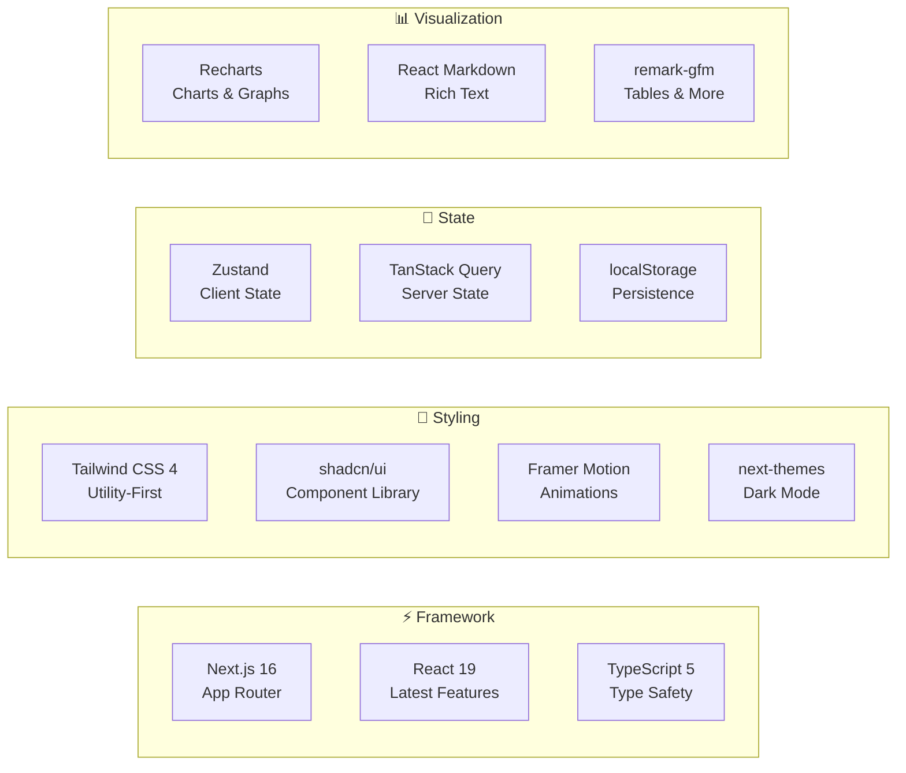

### Backend Stack

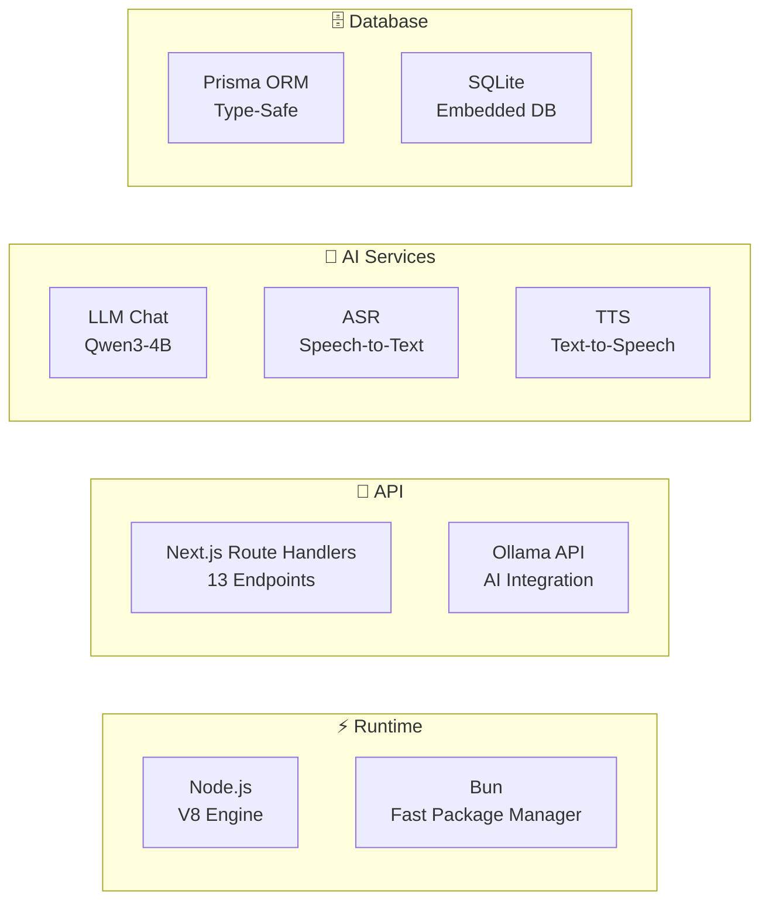

### Complete Dependency Map

```
┌─────────────────────────────────────────────────────────────────┐
│                     PRODUCTION DEPENDENCIES                      │
├──────────────────────┬──────────────────────────────────────────┤
│ Framework            │ next@16.1 · react@19 · react-dom@19     │
│ Language             │ typescript@5 · bun-types                 │
│ Styling              │ tailwindcss@4 · tailwindcss-animate      │
│                      │ tw-animate-css · class-variance-authority│
│                      │ clsx · tailwind-merge                    │
│ UI Components        │ @radix-ui/* (20+ primitives)            │
│                      │ lucide-react · cmdk · sonner · vaul      │
│ State                │ zustand@5 · @tanstack/react-query@5      │
│ Animation            │ framer-motion@12                         │
│ Charts               │ recharts@2                               │
│ Markdown             │ react-markdown · remark-gfm              │
│ Forms                │ react-hook-form · @hookform/resolvers    │
│                      │ zod@4 · input-otp                       │
│ AI                   │ Ollama API (Local)                      │
│ Database             │ @prisma/client@6 · prisma@6              │
│ Auth                 │ next-auth@4                              │
│ Tables               │ @tanstack/react-table@8                  │
│ i18n                 │ next-intl@4                              │
│ Misc                 │ date-fns · sharp · uuid · react-syntax-  │
│                      │ highlighter · react-resizable-panels     │
│                      │ embla-carousel-react · @dnd-kit/*        │
├──────────────────────┴──────────────────────────────────────────┤
│                     DEV DEPENDENCIES                             │
├──────────────────────┬──────────────────────────────────────────┤
│ Build                │ @tailwindcss/postcss · eslint@9          │
│                      │ eslint-config-next@16                    │
│ Types                │ @types/react@19 · @types/react-dom@19    │
└──────────────────────┴──────────────────────────────────────────┘
```

---

## 🎨 Design System

### Color Palette

```
┌─────────────────────────────────────────────────────────────┐
│                    COLOR SYSTEM                              │
│                                                             │
│  Primary: Emerald (#10b981) ─── Financial Growth            │
│  ████████████████████████████████████                        │
│  50  100  200  300  400  500  600  700  800  900            │
│                                                             │
│  Secondary: Teal (#14b8a6) ─── Trust & Stability            │
│  ████████████████████████████████████                        │
│  50  100  200  300  400  500  600  700  800  900            │
│                                                             │
│  Accent: Amber (#f59e0b) ─── Attention & Warnings           │
│  ████████████████████████████████████                        │
│  50  100  200  300  400  500  600  700  800  900            │
│                                                             │
│  Category Colors:                                           │
│  Fixed Deposits  ████████  amber                             │
│  Savings         ████████  green                             │
│  Tax Saving      ████████  rose                              │
│  Investment      ████████  emerald                           │
│  Loans           ████████  orange                            │
│  Senior Citizens ████████  purple                            │
│  Comparison      ████████  teal                              │
│  Govt Schemes    ████████  cyan                              │
│  Tax             ████████  red                               │
│                                                             │
│  Indian Flag Colors (Footer Stripe):                        │
│  Saffron: #FF9933  │  White  │  Green: #138808             │
└─────────────────────────────────────────────────────────────┘
```

### CSS Animation Inventory

| Animation | Duration | Purpose |
|-----------|----------|---------|
| `logo-glow` | 3s infinite | Welcome logo emerald glow |
| `bg-shift` | 15s infinite | Welcome screen gradient shift |
| `send-pulse` | 1.5s infinite | Send button scale pulse |
| `float` | 8s infinite | Floating particles in chat |
| `tips-fade` | 5s | Financial tips banner rotation |
| `score-fill` | On render | Health score circular progress |
| `badge-shimmer` | 3s infinite | Model badge shimmer effect |
| `dialog-enter` | 0.2s | Calculator dialog scale-in |
| `stagger-in` | 0.3s delayed | Result cards sequential entrance |
| `typing` + `blink-caret` | 2.5s | Tagline typing effect |
| `gradient-rotate` | 2s infinite | Feature card hover gradient |
| `confetti-burst` | 1s | Celebration effect |
| `shimmer-load` | 1.5s infinite | Message skeleton loading |
| `progress-fill` | 1s | Goal progress bar fill |
| `tab-underline` | 0.3s | Active tab indicator |
| `bounce-down` | 1.5s infinite | Scroll indicator |

### Typography

```
┌─────────────────────────────────────────────┐
│  Font: Geist Sans (Primary)                 │
│  Font: Geist Mono (Code)                    │
│                                             │
│  Heading 1:  text-2xl font-bold             │
│  Heading 2:  text-base font-semibold        │
│  Heading 3:  text-sm font-medium            │
│  Body:       text-sm leading-relaxed        │
│  Small:      text-xs                        │
│  Tiny:       text-[10px] / text-[8px]       │
│  Mono:       font-mono (config values)      │
└─────────────────────────────────────────────┘
```

### Responsive Breakpoints

| Breakpoint | Width | Target |
|-----------|-------|--------|
| Default | < 640px | Mobile phones |
| `sm:` | ≥ 640px | Large phones |
| `md:` | ≥ 768px | Tablets (dialog threshold) |
| `lg:` | ≥ 1024px | Laptops |
| `xl:` | ≥ 1280px | Desktops |

> **Key behavior**: Calculator dialogs use `Dialog` on desktop (≥768px) and `Sheet` (bottom drawer) on mobile.

---

## 📈 Performance & Metrics

### Response Time Breakdown

```mermaid
gantt
    title Chat Query Processing Timeline
    dateFormat X
    axisFormat %Lms

    section Client
    User types query           :0, 500
    Store dispatch             :500, 600
    Fetch POST /api/chat       :600, 800

    section Server
    Parse request              :800, 900
    Build system prompt        :900, 1000
    Ollama connection          :1000, 1200
    LLM inference (Qwen3-4B)  :1200, 30000

    section Response
    Parse completion           :30000, 30100
    Build JSON response        :30100, 30200
    Send to client             :30200, 30400

    section Client
    Update Zustand store       :30400, 30500
    React re-render            :30500, 30800
    Display to user            :30800, 31000
```

### API Response Times (Typical)

| Endpoint | Avg Time | Notes |
|----------|----------|-------|
| `/api/chat` | 20-45s | Depends on LLM inference |
| `/api/transcribe` | 2-5s | ASR processing |
| `/api/tts` | 1-3s | TTS generation |
| `/api/emi-calculator` | <50ms | Pure computation |
| `/api/tax-calculator` | <50ms | Pure computation |
| `/api/sip-calculator` | <50ms | Pure computation |
| `/api/compound-interest` | <50ms | Pure computation |
| `/api/retirement-calculator` | <50ms | Pure computation |
| `/api/inflation-calculator` | <50ms | Pure computation |
| `/api/financial-data` | <100ms | Cached reference data |

### Bundle Size Optimization

```
┌─────────────────────────────────────────────┐
│  Optimization Strategies Applied:           │
│                                             │
│  ✅ Dynamic imports for heavy components    │
│  ✅ Recharts tree-shaking (named imports)   │
│  ✅ Image optimization via sharp            │
│  ✅ CSS purging via Tailwind                │
│  ✅ Route-level code splitting              │
│  ✅ localStorage for persistence (no DB)    │
│  ✅ Ollama direct API (No SDK)             │
│  ✅ Retry with exponential backoff          │
│  ✅ History limited to last 6 messages      │
│  ✅ 50 message storage cap                  │
└─────────────────────────────────────────────┘
```

---

## 🔒 Privacy & Security

### Privacy Architecture


### Privacy Features

| Feature | Implementation |
|---------|---------------|
| 🔒 No Cloud PII | User data stays in localStorage |
| 🔒 Anonymized Prompts | Only financial queries sent to LLM |
| 🔒 No User Accounts | No login/signup required |
| 🔒 No Tracking | Zero analytics or tracking scripts |
| 🔒 No Cookies | Only localStorage for preferences |
| 🔒 On-Device Calculators | All 7 calculators run client-side |
| 🔒 Voice Privacy | Audio processed via ASR, not stored |
| 🔒 AI Disclaimer | Every response includes disclaimer |
| 🔒 RBI Notice | Not affiliated with RBI/SEBI/IRDAI |

### Data Flow Privacy Map

```
┌──────────────────────────────────────────────────────┐
│                    WHAT GOES WHERE                    │
│                                                      │
│  User Input (Query)  ──→  LLM API  ──→  Response    │
│  (financial question)    (anonymized)    (in Hindi)   │
│                                                      │
│  User Voice          ──→  ASR API   ──→  Transcript  │
│  (audio blob)           (temp file)     (text only)  │
│                                                      │
│  AI Response         ──→  TTS API   ──→  Audio       │
│  (text)                 (clean text)    (WAV file)   │
│                                                      │
│  Calculator Inputs   ──→  API Route  ──→  Results    │
│  (numbers only)         (server-side)    (JSON)      │
│                                                      │
│  Chat History        ──→  localStorage              │
│  (messages)             (device only)                │
│                                                      │
│  Language Pref       ──→  localStorage              │
│  (hi/ta/bn/etc.)        (device only)                │
│                                                      │
│  🚫 NEVER SENT: Name, Email, PAN, Aadhaar,          │
│     Account Numbers, Bank Details, IP Address        │
└──────────────────────────────────────────────────────┘
```

---

## 🗺️ Roadmap

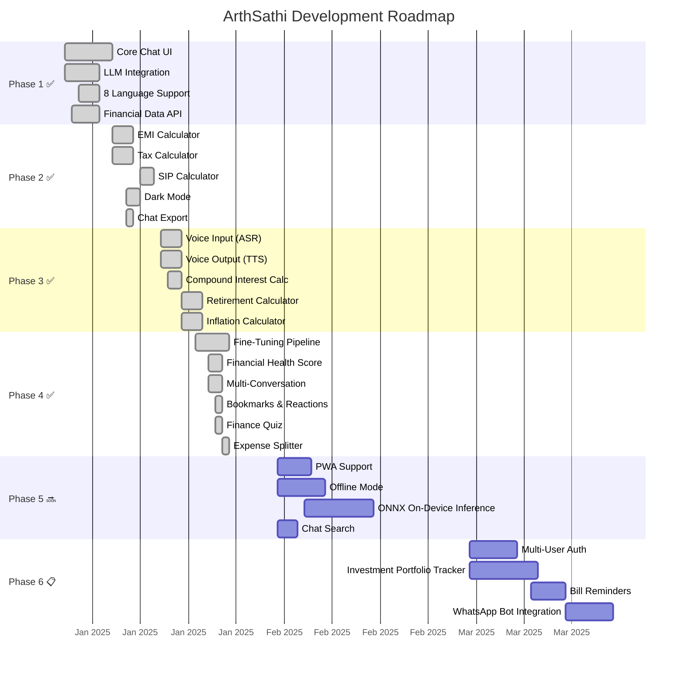

### Upcoming Features

| Priority | Feature | Description |
|----------|---------|-------------|
| 🔴 High | PWA Support | Install as app on mobile |
| 🔴 High | Offline Mode | Service worker + cached responses |
| 🔴 High | ONNX Inference | Run model directly in browser |
| 🟡 Medium | Chat Search | Full-text search across conversations |
| 🟡 Medium | Investment Tracker | Portfolio management with live prices |
| 🟡 Medium | Bill Reminders | Notification system for upcoming bills |
| 🟢 Low | WhatsApp Bot | Integration with WhatsApp Business API |
| 🟢 Low | Multi-User Auth | User accounts with NextAuth.js |
| 🟢 Low | API Gateway | Rate limiting + usage analytics |

---

## 🤝 Contributing

We welcome contributions! Here's how you can help:

### Development Workflow

```
1. Fork the repository
2. Create a feature branch: git checkout -b feature/amazing-feature
3. Make your changes
4. Run linting: bun run lint
5. Commit: git commit -m 'Add amazing feature'
6. Push: git push origin feature/amazing-feature
7. Open a Pull Request
```

### Code Style Guidelines

- **TypeScript** throughout with strict typing
- **ES6+** import/export syntax
- **shadcn/ui** components preferred over custom implementations
- `'use client'` and `'use server'` for client/server boundaries
- **Tailwind CSS** utility classes for styling
- **Indian number formatting** (`₹1,23,456` not `₹123,456`)
- **Hindi-first** for sample queries and default language

### Areas for Contribution

- 🌐 Additional Indian language support
- 🧮 New financial calculators
- 📊 More comprehensive financial data
- 🎨 UI/UX improvements
- 🧪 Testing and QA
- 📝 Documentation and examples
- 🤖 Model fine-tuning improvements

---

## 📄 License

This project is licensed under the MIT License — see the [LICENSE](LICENSE) file for details.

---

<div align="center">

### 🇮🇳 Made with ❤️ for Bharat

**अर्थसाथी** — *भारत का अपना वित्तीय साथी*

*Your Financial Companion — Built in India, for India*

```
┌────────────────────────────────────────────────────────┐
│  ⚠️ DISCLAIMER                                        │
│                                                        │
│  ArthSathi is an AI-powered advisory tool, not a      │
│  registered financial advisor. All responses are       │
│  AI-generated guidance. Please consult a certified     │
│  financial planner before making important financial   │
│  decisions.                                            │
│                                                        │
│  ArthSathi is not affiliated with RBI, SEBI, or       │
│  IRDAI. Data sources: RBI, NPCI, India Post.          │
└────────────────────────────────────────────────────────┘
```

</div>
