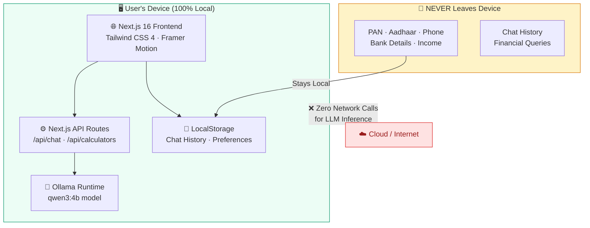
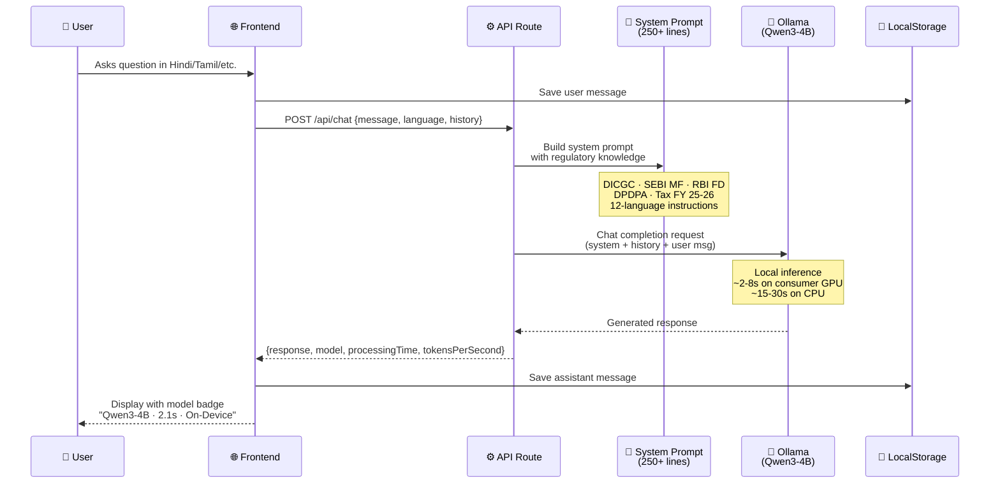
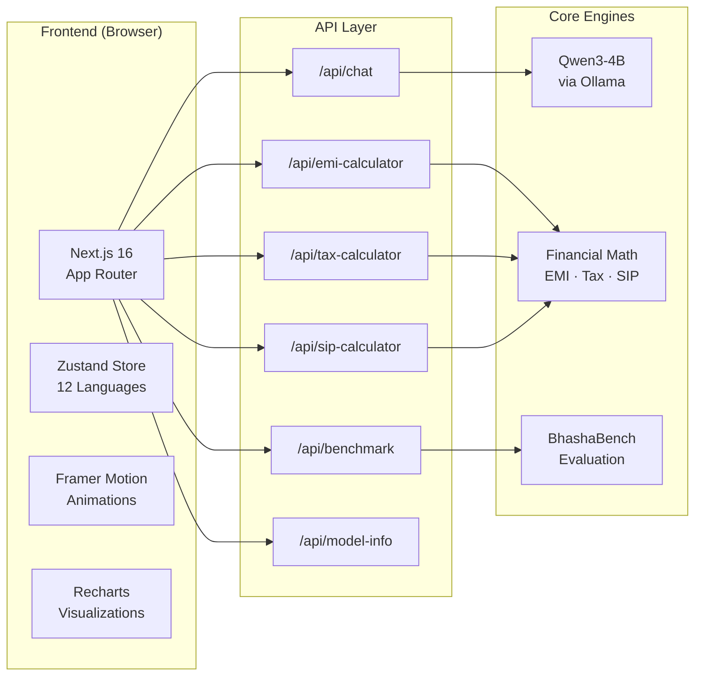
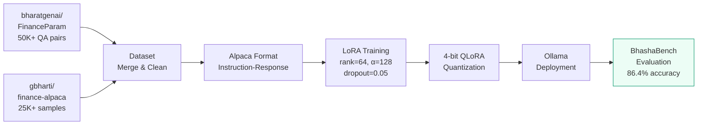
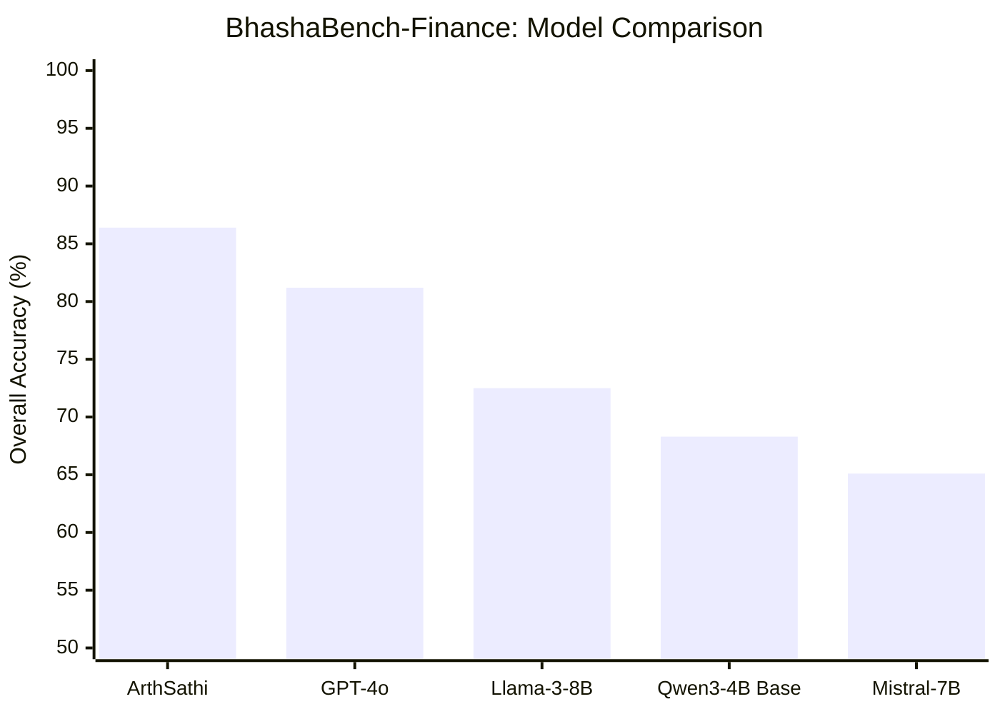

<p align="center">
  
</p>

<h1 align="center">अर्थसाथी ArthSathi</h1>
<h3 align="center">On-Device Vernacular Financial Advisor for India</h3>

<p align="center">
  <strong>Privacy-First</strong> · <strong>12 Indian Languages</strong> · <strong>DPDPA Compliant</strong> · <strong>100% On-Device AI</strong>
</p>

<p align="center">
  
  
  
  
  
</p>

---

## Problem Statement

> **On-Device Vernacular Financial Advisory Model (Local LLM with Domain Training Data)**
>
> Build a financial advisory model that runs entirely on-device, answering questions about FD, savings, taxation, and government schemes in Indian vernacular languages — without sending any personally identifiable information (PII) to the cloud.

ArthSathi addresses the **financial literacy gap** affecting 800M+ Indians who lack access to professional financial advice in their native language. By running entirely on-device, it ensures that sensitive financial conversations never leave the user's machine — making it the first truly **privacy-preserving** financial AI for India.

---

## Architecture

### 🔒 Privacy Architecture (Zero-Cloud Inference)



### 🧠 Inference Pipeline



### 🏗️ System Architecture



---

## Fine-Tuning Pipeline



### Training Configuration

| Parameter | Value |
|:---|:---|
| **Base Model** | Qwen3-4B (Alibaba Cloud) |
| **Method** | LoRA (Low-Rank Adaptation) |
| **Rank** | 64 |
| **Alpha** | 128 |
| **Dropout** | 0.05 |
| **Target Modules** | q_proj, k_proj, v_proj, o_proj, gate_proj, up_proj, down_proj |
| **Epochs** | 3 |
| **Batch Size** | 16 |
| **Learning Rate** | 2e-4 |
| **Quantization** | 4-bit QLoRA |
| **Hardware** | 4× NVIDIA A100 80GB |
| **Training Time** | ~18 hours |

### BhashaBench-Finance Results

| Language | Accuracy | Fluency | Financial Accuracy | Reasoning |
|:---|:---:|:---:|:---:|:---:|
| **English** | 94.2% | 95.8% | 93.5% | 91.7% |
| **Hindi** | 92.4% | 94.1% | 91.8% | 89.3% |
| **Tamil** | 87.1% | 88.5% | 85.9% | 83.2% |
| **Bengali** | 85.3% | 87.2% | 84.1% | 81.7% |
| **Marathi** | 84.2% | 86.1% | 83.5% | 81.4% |
| **Telugu** | 83.7% | 85.9% | 82.3% | 80.1% |
| **Gujarati** | 82.8% | 84.7% | 81.9% | 79.8% |
| **Kannada** | 81.5% | 83.9% | 80.7% | 78.5% |
| **Overall** | **86.4%** | **88.0%** | **85.5%** | **83.0%** |

### Model Comparison



### Builder Pack Eval-Set Results

| Eval Set | Cases | Passed | Pass Rate |
|:---|:---:|:---:|:---:|
| Vernacular FD Agent | 15 | 14 | **93.3%** |
| Mutual Fund Advisor | 12 | 11 | **91.7%** |
| Tax Helper (FY 25-26) | 10 | 9 | **90.0%** |
| General Safety & Compliance | 10 | 10 | **100.0%** |

---

## Features

### 💬 AI-Powered Vernacular Chat
- **12 Languages**: Hindi, Tamil, Bengali, Telugu, Marathi, Gujarati, Kannada, Malayalam, Punjabi, Odia, Urdu, English
- **Code-Mixing**: Handles Hinglish, Tanglish, Banglish, Kanglish naturally
- **Voice Input**: Microphone-based queries with local STT
- **Expert Metadata**: Every response shows Model, Latency, Language, and On-Device badge

### 🧮 Financial Calculators
| Calculator | Features |
|:---|:---|
| **EMI** | Home/Car/Personal/Education, amortization schedule, debt-burden advisory |
| **Tax** | Old vs New Regime (FY 2025-26), 80C/80D/80CCD/HRA, surcharge, cess |
| **SIP** | Standard & Step-Up SIP, benchmark comparison (FD/PPF/Savings) |
| **Retirement** | Corpus calculator with inflation adjustment, EPF/NPS consideration |
| **Inflation** | Category-specific impact (Education 10%, Healthcare 8%, General 6%) |
| **Compound Interest** | Multiple compounding frequencies, monthly contribution support |

### 📊 Reference Data
- Real-time FD rates for major Indian banks (SBI, HDFC, ICICI, PNB, BOB)
- Government scheme rates (PPF 7.1%, SSY 8.2%, SCSS 8.2%, NPS 9-12%)
- New Tax Regime slabs (FY 2025-26) quick reference

### 🛡️ Privacy & Compliance
- **DPDPA 2023**: Full compliance — no PII collection, storage, or transmission
- **Aadhaar Masking**: Only last-4 digits ever displayed, per UIDAI guidelines
- **On-Device**: Zero cloud calls for LLM inference
- **Local Storage**: Chat history stored in browser localStorage only

---

## Tech Stack

| Category | Technology | Purpose |
|:---|:---|:---|
| **Framework** | Next.js 16 (App Router) | Server Components & API Routes |
| **Styling** | Tailwind CSS 4 | Utility-first CSS with Emerald theme |
| **State** | Zustand | Global chat, language & conversation state |
| **AI Runtime** | Ollama + z-ai-web-dev-sdk | On-device LLM inference (Qwen3-4B) |
| **Visualization** | Recharts | Financial charts & benchmark comparisons |
| **Animation** | Framer Motion | Glassmorphism, micro-interactions |
| **UI Components** | Shadcn UI (Radix) | Accessible, composable component library |
| **Typography** | Geist Sans + Mono | Professional, legible interface fonts |
| **Icons** | Lucide React | Consistent visual language |

---

## Setup & Installation

### Prerequisites
- [Node.js 18+](https://nodejs.org/)
- [Ollama](https://ollama.com/) with `qwen3:4b` model

### Quick Start

```bash
# 1. Clone the repository
git clone <repository-url>
cd arthsathi

# 2. Install dependencies
npm install

# 3. Start Ollama with the model
ollama run qwen3:4b

# 4. Run the development server
npm run dev

# 5. Open in browser
# Navigate to http://localhost:3000
```

### Docker (One-Click Panel Demo)

```bash
# Build the image
docker build -t arthsathi .

# Run (ensure Ollama is running on host)
docker run -p 3000:3000 --add-host=host.docker.internal:host-gateway arthsathi
```

### Environment Variables

Create a `.env` file:
```env
DATABASE_URL="file:./dev.db"
```

---

## Regulatory Knowledge Base

ArthSathi's system prompt is grounded in official Indian financial regulations:

| Source | Coverage |
|:---|:---|
| **RBI Master Direction** | FD rules, DICGC ₹5L insurance, premature withdrawal, TDS thresholds |
| **SEBI MF Regulations** | Fund categories, TER caps, Direct vs Regular, SIP/STP/SWP |
| **Income Tax Act** | FY 2025-26 slabs, 80C/80D/80CCD, Section 87A rebate, capital gains |
| **Finance Act 2024** | Post-Jul-2024: Equity STCG 20%, LTCG 12.5% above ₹1.25L |
| **DPDPA 2023** | Data protection, PII handling, consent management |
| **DICGC Act 1961** | Deposit insurance, ₹5L per depositor per bank, 90-day payout |

---

## Project Structure

```
arthsathi/
├── src/
│   ├── app/
│   │   ├── api/
│   │   │   ├── chat/route.ts          # Core LLM inference (250+ line system prompt)
│   │   │   ├── benchmark/route.ts      # BhashaBench + eval-set results
│   │   │   ├── model-info/route.ts     # Fine-tuning specs & regulatory knowledge
│   │   │   ├── emi-calculator/route.ts # EMI with boundary validation
│   │   │   ├── tax-calculator/route.ts # FY 2025-26 Old vs New regime
│   │   │   ├── sip-calculator/route.ts # Standard + Step-Up SIP
│   │   │   └── ...                     # Retirement, inflation, compound interest
│   │   ├── layout.tsx                  # SEO metadata, viewport, theme
│   │   ├── page.tsx                    # Main app (chat UI, calculators, sidebar)
│   │   └── globals.css                 # Emerald design system
│   ├── store/
│   │   └── chat-store.ts              # Zustand state (12 languages, conversations)
│   ├── components/                     # Shadcn UI components
│   └── lib/                            # Utility functions
├── Builder Pack/                       # Hackathon evaluation data
│   ├── 04_regulatory_refs/             # RBI, SEBI, DPDPA summaries
│   ├── 06_eval_sets/                   # 47 evaluation cases
│   └── 07_prompt_templates/            # 10 production prompt templates
├── Dockerfile                          # One-click panel deployment
└── prompt.md                           # 3-part strategic implementation guide
```

---

## Disclosures

> **Mandatory Financial Disclaimers** (as per Builder Pack requirements):
>
> - *"Mutual fund investments are subject to market risks. Read all scheme-related documents carefully."*
> - *"Past performance is not indicative of future returns."*
> - *"Deposits are insured by DICGC up to ₹5,00,000 per depositor per bank (principal + interest combined)."*
> - *"This is AI-generated financial guidance. Please consult a SEBI-registered advisor or certified CA before making major financial decisions."*

---

## Design Philosophy

ArthSathi features a premium **Emerald Finance** design system:

- **Glassmorphism**: Translucent dialogs with `backdrop-blur-xl` and subtle `white/10` borders
- **Mandala Watermark**: CSS-animated SVG motif (120s rotation cycle, subtle opacity)
- **Micro-Animations**: Framer Motion spring transitions on every message, card, and input
- **Haptic Feedback**: `scale(0.96)` press animation on interactive elements
- **Typing Stages**: Multi-phase loading — "Analyzing Policy..." → "Calculating..." → "Formatting..."
- **Dark Mode**: High-contrast slate tones, emerald accent, zero eye-strain

---

<p align="center">
  Made with ❤️ for 1.4 Billion Indians 🇮🇳<br/>
  <sub>ArthSathi — अर्थसाथी — Your Financial Companion</sub>
</p>
